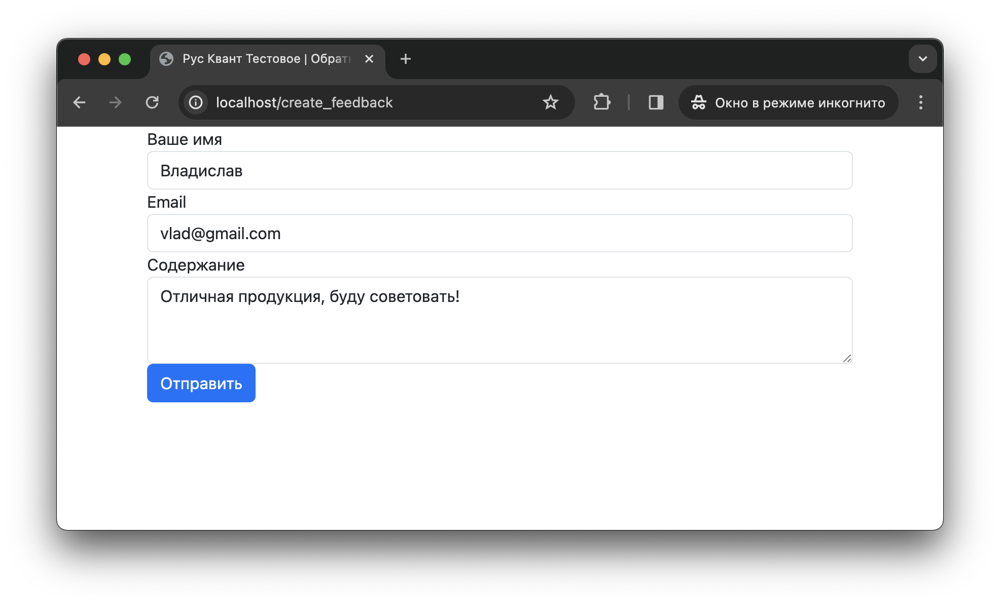

### Запуск (Linux, MacOS)
1. Установить Docker
2. Запустить скрипт ./start.sh

### Использование
Перейти по [ссылке](http://localhost/), чтобы убедиться что сервис доступен

Перейти по [ссылке](http://localhost/create_feedback), чтобы испробовать функционал
